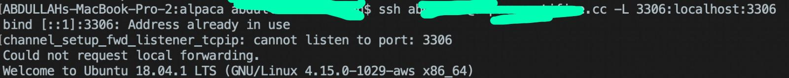

# JDBC Setup for Alpaca

## Requisite software :

+ Java 8
+ jConnector
+ mySQL
+ Solr 

## Installing MySQL shell on Linux

<pre>
sudo apt-get update 

apt-get install mysql-server
</pre>

## Getting into the MySQL shell  

<pre>
mysql -u root
</pre>

## Setting up a superuser

<pre>
CREATE USER 'username'@'localhost' IDENTIFIED BY 'password';
</pre>

## Grant all privileges to that user so it can have root privileges 

<pre>
GRANT ALL PRIVILEGES ON *.* TO 'user'@'localhos';
</pre>

## Getting into the database 
First ssh into your server. Then use your username and your password to get into MySQL. 

<pre>
mysql -u username -p password 
</pre>

## Get into database 

<pre>
use alpaca;
</pre>

## See all tables

<pre>
show tables;
</pre>

## Backup database 
By default, mysqldump writes information as SQL statements to the standard output. Save the output in a file: 

<pre>
shell> mysqldump --user=username --password --lock-tables --databases db_name > db_name.sql
</pre>

## Restoring database from mysqldump

<pre>
mysql -u[username] -p[password] -h[hostname] [database name] < [filename].sql
</pre>

## Installing

Installing jConnector to the Java project to access the database
Here is the download link for jConnector
https://dev.mysql.com/downloads/connector/j/

### Add to the build path

In order to connect mySQL to the java code, the jConnector should be added in the JAR library under build path 

### Connects to the server:

<pre>
Connection connection = DriverManager.getConnection("path/to/the/database", username, password);
//username is the database username, and the password of that username
</pre>

## 12 Features:

In the project, it has 12 features that has been executed, 
the idea from them is to have easy access and manuiplaute database queires
in the java code.

### Example:
<pre>
System.out.println("1. What is the total number of vulnerabilities?");
</pre>
### Execute:
<pre>
ResultSet rs = statement.executeQuery("SELECT COUNT(*) FROM vuln;");
            //get the resulting number
            rs.next();
            int count = rs.getInt(1);
            //print out the answer
            System.out.println("\tThere is a total of " + count + " vulnerabilities.");
</pre>
it counts the vulnerabilities and execute a query from Java in order to count them

### Example:
<pre>
System.out.println("3. Which vulnerabilities employ a brute force technique to login?");
</pre>
### Execute:
<pre>
rs = statement.executeQuery("SELECT vuln_id, vuln_name, vuln_description FROM vuln WHERE vuln_name LIKE '%brute-force%';");
            //zeros the counter
            int i = 0;
            while (rs.next()) {
                //increase the counter
                i++;
                //print out the answer
                System.out.println("\tID = " + rs.getInt(1) + ", Vulnerability: " + rs.getString(2) + ", Description: " + rs.getString(3));
            }

</pre>
Here, it should take a sql query the %like% and display any vulnerability that has brute force

## Run the Program

In order to run the program, the user must login to the ssh server
using the tunnel in the command line

<pre>
$ssh username@remoteserver -L 3306:localhost:3306 
</pre>
### * Note : the mySQL server should be stopped in your local machine before executing the program. Other wise, the address would be used twice and might cause an error.

## Installing MySQL Connector/J on the server
MySQL Connector/J is the official JDBC driver for MySQL. 

<pre>
$ wget [url with the file needed]
</pre>

Copy file from the downloaded archive 'mysql-connector-java-*.jar' to the folder 'contrib/dataimporthandler/lib' in the folder where Solr is installed. You may need to create the lib folder if you don't have it.

<pre>
$ cp mysql-connector-java-5.1.30-bin.jar ../Solr/solr-7.5.0/contrib/dataimporthandler/lib 
</pre>

Your desired directory will have a slightly different path. The above cp command is ran while I was in the .jar directory
